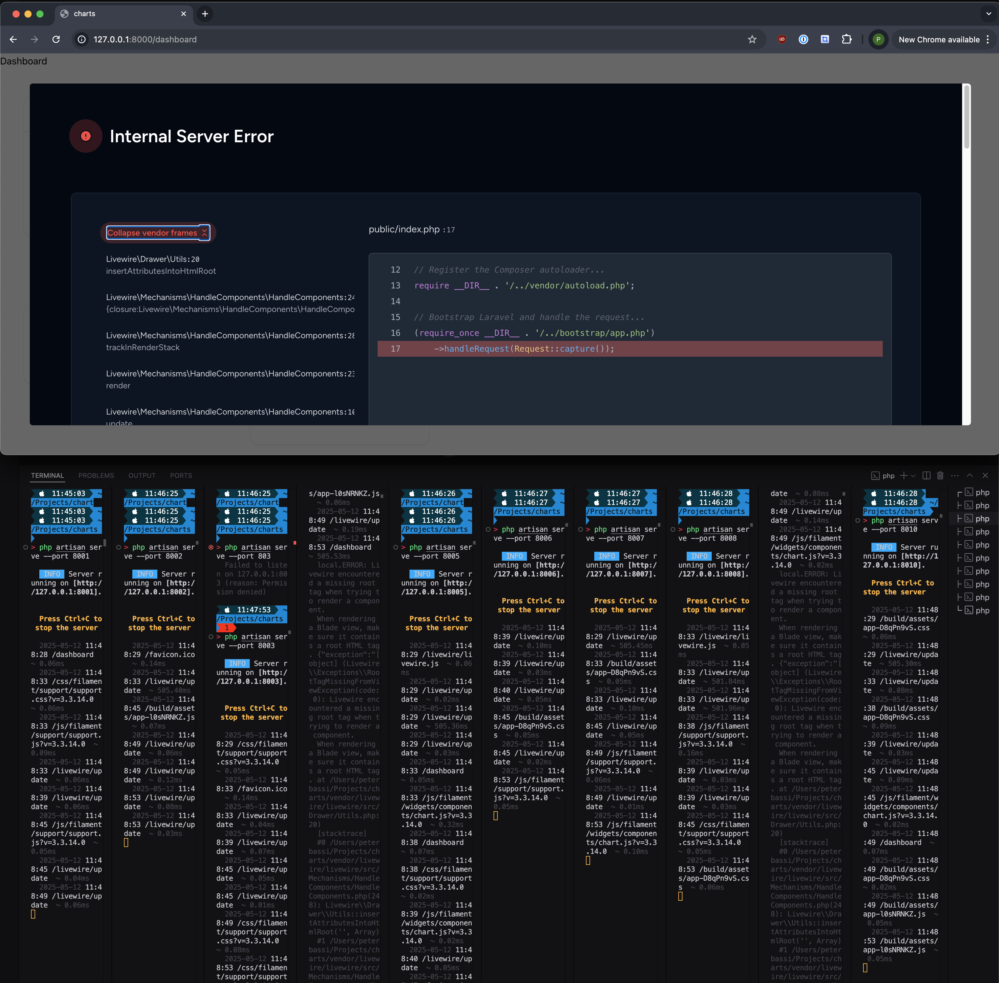

Simple project to demonstrate view cache issue in Livewire.

Dashboard configured to show 10 Filament chart widgets in a 5-column/2-row layout.

Uses Caddy server to load balance and PHP's built-in dev server through `php artisan serve`

## Install and Run

### Clone Project

```
git clone https://github.com/peterjbassi/charts.git
```

### Run Composer

```
composer install
```

### Run Artisan (PHP) Servers

```
*** RUN EACH IN SEPARATE TAB/WINDOW ***

php artisan serve --port 8001
php artisan serve --port 8002
php artisan serve --port 8003
php artisan serve --port 8004
php artisan serve --port 8005
php artisan serve --port 8006
php artisan serve --port 8007
php artisan serve --port 8008
php artisan serve --port 8009
php artisan serve --port 8010
```

### Start Caddy Load Balancer

```
CADDY_LB_POLICY=round_robin caddy reverse-proxy \
    --from http://127.0.0.1:8000 \
    --to 127.0.0.1:8001,127.0.0.1:8002,127.0.0.1:8003,127.0.0.1:8004,127.0.0.1:8005,127.0.0.1:8006,127.0.0.1:8007,127.0.0.1:8008,127.0.0.1:8009,127.0.0.1:8010
```

### View in Browser

Open your browser to `http://127.0.0.1:8000/dashboard`

## Expected Result

One or more of the chart requests to `/livewire/update` will randomly fail.

You may need to run `php artisan view:clear` (followed by a page refresh) a few times to trigger the issue.

More server instances should reproduce the exception more easily.


